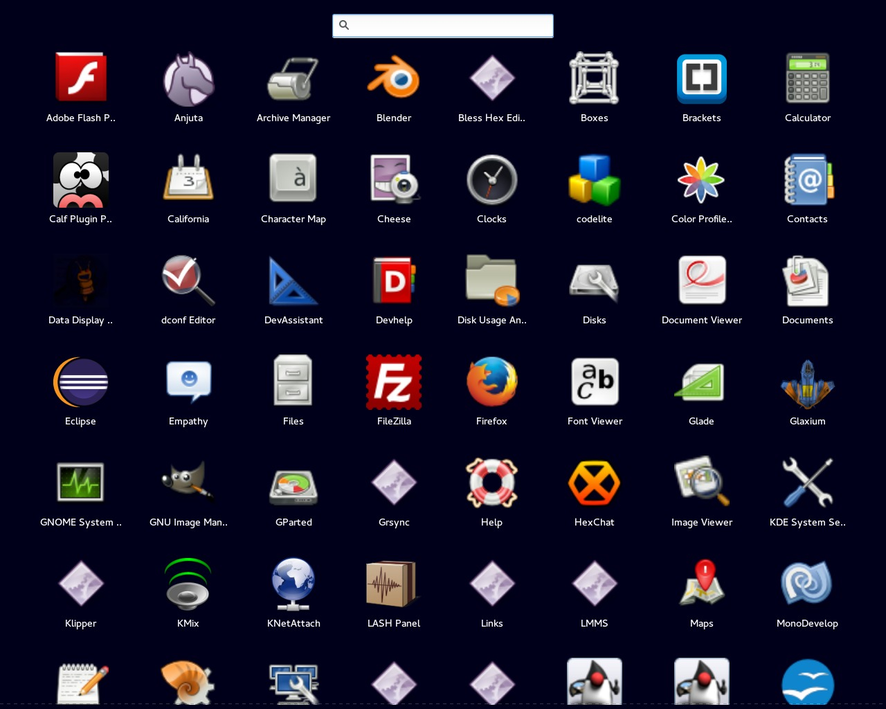

Rapid Launcher
===============

Rapid Launcher is an application launcher that is supposed to be fast and relatively lightweight.

The backend is written in Vala and the frontend is written with C/GTK+ 3.

Rapid Launcher is born to give a good launcher also for old PCs. It's really simple and is inspired by the Android and OSX launchers.

**NOTE:** Clone this repository using: `git clone --recursive https://github.com/echo-devim/RapidLauncher.git`

### Usage

Use the `inmem` option to keep the application in memory speeding up all the next times you will open the application.

### Version

0.3

### Dependencies

Install gtk+ 3 devel to compile this software. For Fedora/RHEL/CentOS is `gtk3-devel` and for Ubuntu/Debian is `libgtk-3-dev`.

### TODO

* Align the matching applications of a search in the right way

### License

GPLv3
